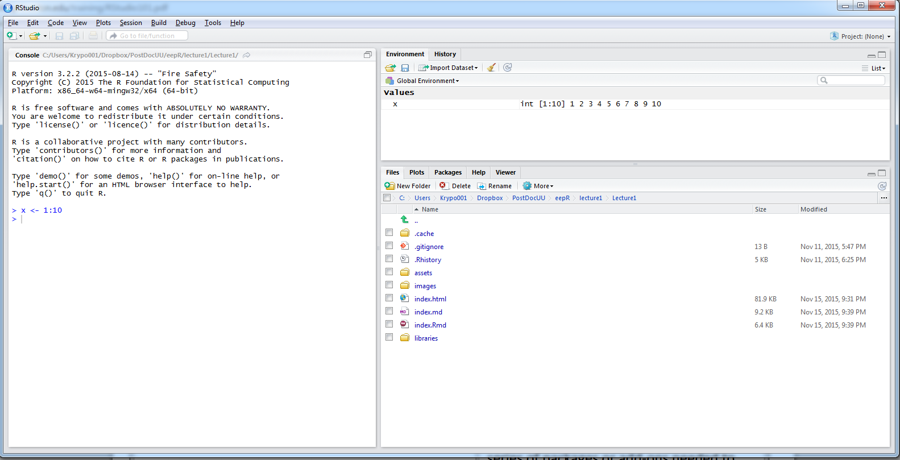
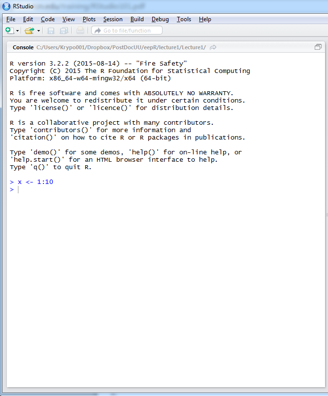
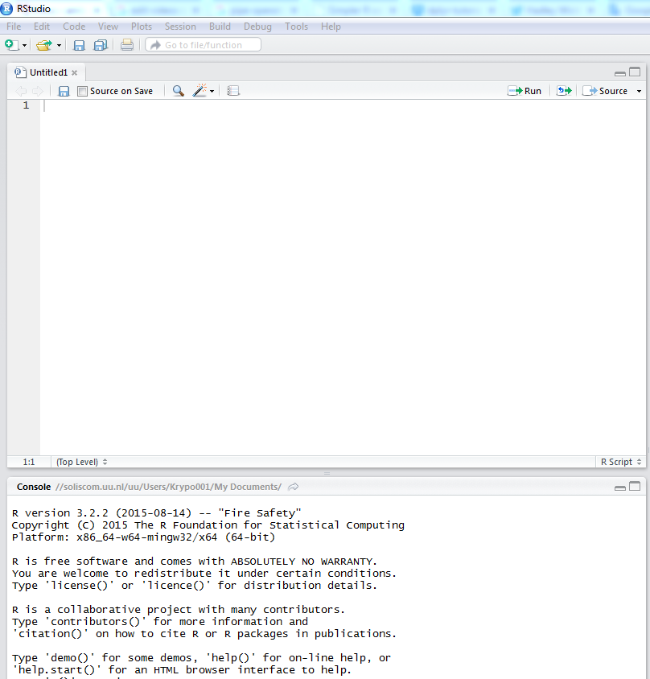
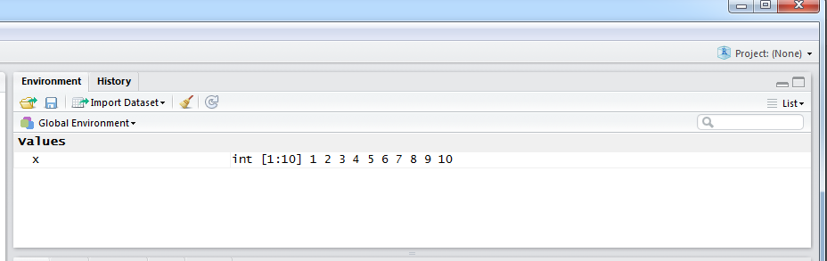
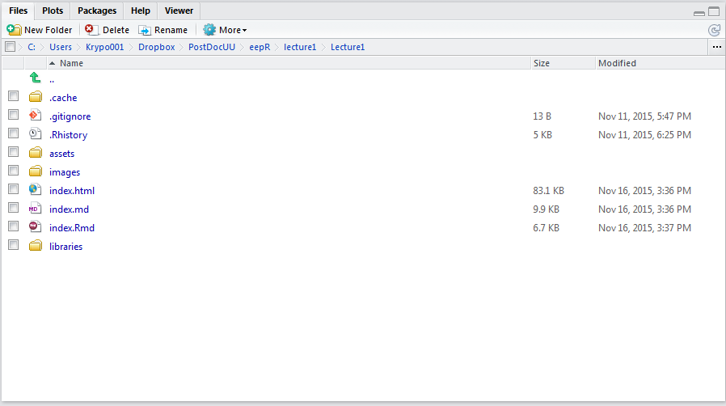
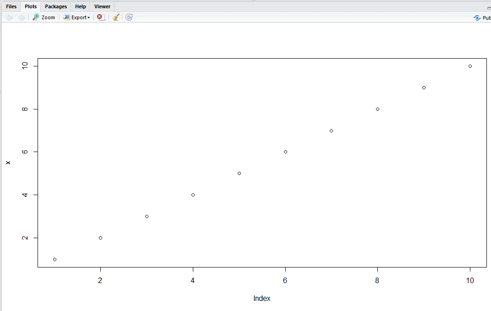
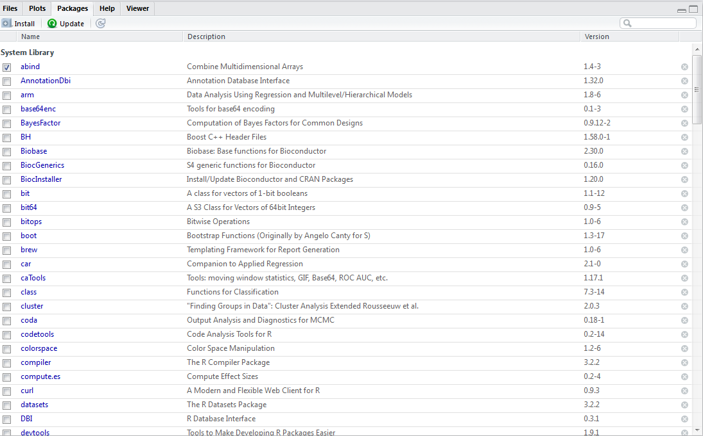
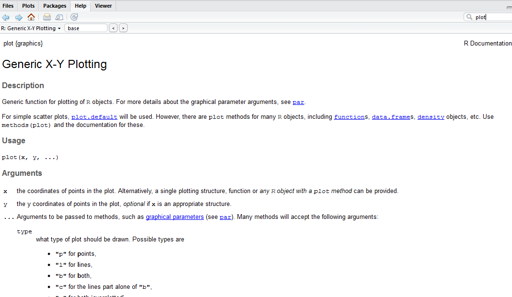

[//]: # (THIS IS NOT THE FINAL SLIDE SHOW AS PERSONAL INFO -- SEE TWITTER EXAMPLE -- HAD TO BE REMOVED)


[//]: # (Change the background color of the title slide)

<style>
  .title-slide {
    background-color:  #EDE0CF; /*; ; #CA9F9D*/
      /* background-image:url(http://goo.gl/EpXln); */
  }
</style>

<style>
slide.smallcode pre {
  font-size: 11px;
}
</style>

<div style='text-align: center;'>
    
</div>

<div style='text-align: center;'>
    <font size="1">legacyofshadow.com/wp-content/uploads/2012/04/no-return-sign.jpg</font>
</div>

--- &twocol
## Goals of today's presentation

*** =left

- Show you what R can do

- Explain the very basics on how R is *think*

- Provide concrete arguments on why R is relevant for your work

> - And all of these in 2 hours

*** =right 

<div style='text-align: center;'>
    
</div>

<div style='text-align: center;'>
    <font size="1">https://cran.r-project.org/logo.html</font>
</div>

---
## Outline

- 1) The thing called R

- 2) Demo

- 3) Course issues

- 4) R and R studio

- 5) How R *thinks*

- 6) A hands-on example


---
## The thing called R

> - R is a programming language and softwared environment widely used for statistical analysis, data manipulation, and plotting

> - Birth: 1993 by **R** oss Ihaka and **R** obert Gentleman

> - After 22 years, R is more popular than ever before!

> - But why?

---
## Why R is cool

> - R allows a wide array of statistical analyses

> - R can produce jaw dropping plots

> - It can be combined with other languages (e.g., markdown) 

> - It is free and open source

> - Large supporting community

<div style='text-align: center;'>
    
</div>

<div style='text-align: center;'>
<font size="1">greatwinenews.com/vineyard/uploads/2013/01/ice.jpg</font>
</div>

---
## Why R is hot

> - The type of analyses served by R are growing exponentially

> - R is growing, whereas alternative statistical programs (e.g., SPSS) remain largely static

> - Reproducible research (@xieyihui)

> - R studio makes R more user friendly 

> - Modern packages makes R easier to learn (@hadleywickham)

<div style='text-align: center;'>
    
</div>

<div style='text-align: center;'>
<font size="1">weknowyourdreams.com/image.php?pic=/images/fire/fire-02.jpg</font>
</div>

---
## So why an EPPist should use R?

1. Quickly read, and manipulate data

2. Perform basic and advanced analyses

3. Load multiple data sets into a single session

4. Create publish quality plots

5. Create reports

6. Share easily data with others

---
## Is everything so good with R?

> - Far from it...

> - It takes long time to learn, and handle

> - **Domain specific language** (but this is somehow changing)

> - Compared to SPSS, it is easier to make mistakes with R

--- .quote .segue .nobackground 

<q>Demo</q>

---
## Simple stuff that you can do with R

```{r results = 'asis', comment = NA}
"Hello, World!"
```


```{r results = 'asis'}
2 + 2
```

```{r results = 'asis'}
1000/10
```

```{r results = 'asis'}
1:10 - .5
```

---
## Statistical analyses with R (t-test)


```{r, class="fragment"}
anxiety <- c(20, 30, 40, 15, 34, 21)
groups  <- rep(1:2, each = 3)
t.test(anxiety~ groups)
```

---
## Statistical analyses with R (Bayesian t-test)

```{r}
library(BayesFactor)
anxiety <- c(20, 30, 40, 15, 34, 21)
groups  <- rep(1:2, each = 3)
ttestBF(anxiety[groups == 1], anxiety[groups == 2])
```

--- 
## R plots

```{r results = 'asis', fig.align='center', fig.width= 10, fig.height = 5}
layout(t(1:3))
plot(1:10, type = "b")
hist(rnorm(1000))
barplot(matrix(1:4, 2, 2), beside = T, col = 1:4)
```

---
## R plots

```{r results = 'asis', fig.align='center', fig.width= 10, fig.height = 5}
library(ggplot2)
qplot(age, circumference, data = Orange, geom = c("point", "line"), colour = Tree)
```

<div style='text-align: center;'>
<font size="1">http://blog.echen.me/2012/01/17/quick-introduction-to-ggplot2/</font>
</div>


--- .smallcode
## Twitter


```{r echo = FALSE, message = FALSE, out.width= 4, message = FALSE}
library(twitteR)
#' You need to find your own api and token codes
api_key <- ""
api_secret <- ""
access_token <- ""
access_token_secret <- ""
```

```{r echo = TRUE, results = 'asis', message = FALSE, fig.width=10, fig.height=4, fig.pos="center", warning = FALSE, results = "hide", fig.align='center'}
library(twitteR)
setup_twitter_oauth(api_key,api_secret,access_token,access_token_secret)
twiz <- try(searchTwitter("@KevinvSchie", since = "2015-11-12"))
twizSN <- do.call("rbind", lapply(twiz, function(x) paste0("@", x$screenName)))
barplot(table(twizSN), col = "skyblue", main =  "People interacting with Kevin!")
```

--- .smallcode
## Twitter

```{r echo = FALSE, message = FALSE, out.width= 4, message = FALSE}
library(twitteR)
api_key <- ""
api_secret <- ""
access_token <- ""
access_token_secret <- ""
```

```{r echo = TRUE, results = 'asis', message = FALSE, fig.width=10, fig.height=4, fig.pos="center", warning = FALSE, results = "hide", fig.align='center'}
setup_twitter_oauth(api_key,api_secret,access_token,access_token_secret)
twiz <- try(searchTwitter("@SophievanUijen", since = "2015-11-12"))
twizSN <- do.call("rbind", lapply(twiz, function(x) paste0("@", x$screenName)))
barplot(table(twizSN), col = "skyblue", main =  "People interacting with Sophie!")
```


---- .quote .segue .nobackground 
<q> Details about the course that *you* can follow </q>


--- ds:noborder, bg:white
## Goals of the course

> - Get you excited
> - Lose your fears about programming
> - Learn the very basic of how R *works*
> - Be able to manage your data, perform basic analyses, make plots, and create custom functions
> - Have fun!

<div style='text-align: center;'>
    
</div>

---
## Course arrangement

```{r, echo = FALSE, results = 'asis'}
library(xtable)

classSch <- matrix(c("1", "January 8 2016", "1) Objects, 2) Indexing, 3) Directories",
                    "2", "January 22 2016", "1) Loading Data (e.g., xls, sav), 2) Loops",
                    "3", "February 5 2016", "Introduction to plots",
                    "4", "February 19 2016", "1)Plots advanced 2) Functions",
                    "5", "March 11 2016", "Statistical Analyses with R (t.tests, ANOVAs, GLM)"), dimnames <- list(NULL, c("Class No", "Date", "Topics")), nrow = 5, ncol = 3, byrow = T)
classSch <- data.frame(classSch)
rownames(classSch) <- NULL

print(xtable(classSch), type = "html")

```

> - Class duration: 2 hours

> - Homework: 8 - 10 hours

> - Homework should be handed in before the beginning of the class

> - All materials available at: https://github.com/AngelosPsy/EPPR

> - Participation is absolutery voluntary...

> -  ... but please do leave me talking to the wall

> - Any questions, recommendations?

--- .quote .segue .nobackground 

<q>R and R studio</q>

--- 
# R and R studio

- R can be downloaded from [https://cran.r-project.org/](https://cran.r-project.org/)
- Also download R-studio (https://www.rstudio.com/) (Recommended)
- Both R and Rstudio are platform independent and free (free standing for freedom)

---
## R studio 
### (The big picture)

<div style='text-align: center;'>
    
</div>

--- &twocol
## Console 
### (Where the magic happens)

*** =left

<div style='text-align: center;'>
    
</div>

*** =right
Here you can type in your code.

The symbol '>' means that R expects  your input

The symbol '+' means that R expects more from you (e.g., you have not closed the brackets)

Finish every order by pressing <Enter>

--- &twocol
## Scripts 
### (My notes for later on)

*** =left

<div style='text-align: center;'>
    
</div>

*** =right
- To start a script go to File -> New File -> R script

- Just write your commands there, and then copy-paste them (or source them)
to the console

- Save your scripts by using ".R" as the file's extension

- Although R will not complain, your scripts should be logically organized and
include comments (This is important for your future self)

--- &twocol
## Environment 
### (My hood)

*** =left

<div style='text-align: center;'>
    
</div>

*** =right
Here you can check the names, values, of all the objects and functions that currently available. 

R is able to work with the objects that are currently loaded in its environment(s)

Use 'ls()' to see the objects of the selected enviroment

Use 'rm(*x*)' to remove the object *x* from a specific environment


--- &twocol
## Files

*** =left

<div style='text-align: center;'>
    
</div>

*** =right
It shows you all the files of, unless otherwise specified, your default working directory

--- &twocol
## Plots 
### (I <3 pictures)

*** =left

<div style='text-align: center;'>
    
</div>

*** =right
Your plots will appear here. Be careful! In case of large plots, you need to resize that window (see error Error in plot.new() : figure margins too large)

Alternatively, you can save your plots  to another graphics device (e.g., PDF, JPEG, POSTSCRIPT)


--- &twocol
## Packages
### (Greed)

*** =left

<div style='text-align: center;'>
    
</div>

*** =right
The available (i.e., already installed) packages. In case you want to load a package, just click on it

R packages, provide additional functions, data, and documentetion than the default packages

CRAN's list of packages [here](https://cran.r-project.org/web/packages/available_packages_by_name.html)

Many people upload their packages onto [Github](https://github.com)

You can load packages by using the function 'library()' (recommended) or 'require()'.


--- &twocol
## Help 
### (Save me)

*** =left

<div style='text-align: center;'>
    
</div>

*** =right
Help tab. There you will find the help pages of all the installed packages.

Alternatively, you can use the '?', '??' symbols, or the functions 
'help.search()', 'apropos()'

For online help: stackoverflow.com, nabble.com, www.r-project.org 

```
?mean
??mean
help.search("mean")
apropos("mean")
```
--- .quote .segue .nobackground 

<q>How R *thinks*</q>


--- .smallcode
## How R things
### The big picture

- Everytime you start R, you start an R **Session**
- Start by feeding R with some commands

--- 
## Before you start you need to know

- R reads one command at a time
- R is case sensitive (i.e., 'x' is different from 'X')
- Use '#' for comments
- R returns errors, warnings, but it does not say anything
about logic errors (which makes sense)

```{r}
#plot(1:10, type = "b")
```

--- 
## Errors

```{r }
# Example of an error
x <- "I like cherries"
X
```

--- 
## Warnings

```{r }
# Example of a warning
x <- 1:2
y <- 3:5
cbind(x, y)
```

--- 
## Logic error

```{r }
# Example of a logic error. Here we wanted to take the sum of the object x. 
# However, instead of using the function 'sum', we used the function 'mean'.
# R will not complain but that does not mean that what we did was correct.

x <- 1:4
mean(x)
```

--- 
## Objects
### A first look

```{r}
x <- c(1, 3, 5)
y <- 5
months <- c("January", "February")
```

To create an object, that will remain in your workplace, you should:

- 1. Give a (meaninful) name (e.g., x, y, months)
- 2. Use an assignment operator (e.g., <-, =)
- 3. Define your object (e.g., 5, c("January", "February"))

We will talk more about objects in a bit

--- .smallcode
## Basic operators

Arithmetic operators
```{r eval=FALSE}
y + 2
8 * 4
```

Boolean operators
```{r}
x > 5
y < 5
x == 4
```

--- 
## Functions
```{r}
mean(x = c(1, 3, 5))
```
> - Functions allow you to perform routine operations, fast, easitly, elegantly
> - Input for the functions can be given in a form of a function's argument(s)
> - Function typically also produce an output
> - R comes with a set of functions (e.g., mean)
> - More functions come by installing R packages (GREED)
> - By the end of the course you will be able to create your own functions


---

## Basic R objects

- vector
- matrix
- array*
- list*
- data.frame*

*omitted from today's presentations

---
## Basic R objects
### Vectors

```{r}
x = c(53, 132, 4)
x
y = c("apple", "orange")
y
```

- Keeping together numbers or strings 

- If more than 1 entity, the different entities should be included in
the function c()

- In case of a sequence of numbers (e.g., 1:10), c can be ommitted

----

## Basic R objects
### Matrix

``` {r }
x <- matrix(c(134, 414, 211, 5523), nrow = 2, ncol = 2)
x
```

- Crude description: 2 dimensional vectors
- You need to define a matrix by using the function matrix()


----

## Read data

R can read, among others:

- 1. txt files
- 2. csv files
- 3. sav files
- 4. .Rdata files (of course)

```{r, eval = FALSE}
# utils package
x <- read.table("myfile.txt")
y <- read.csv("myfile.csv")
# readr package
library(readr)
x <- read_csv("myfile.csv")
# foreign package
library(foreign)
spssfile <- read.spss("myfile.sav")
```

----

## Test your knowledge
  
  ```{r  fig.align='center', fig.width= 10, fig.height = 5}
layout(1)
anxiety <- c(20, 30, 40, 15, 34, 21)
depression  <- c(10, 20, 10, 25, 43, 12)
plot(x = anxiety, y = depression)
```


----

## Plots

- The plot function is used to draw (some) plots
- Myriads of other R packages for plots (e.g., lattice, ggplot2)
- For the plot function, you need to plug in, at least, your data

```{r fig.align='center', fig.width= 15, fig.height = 5}
layout(t(1:2))
plot(1:10)
plot(1:10, pch = 1:10, col = 1:10, bty = "n", cex = 2, ylab = "", las = 1)
```

--- .quote .segue .nobackground 

<q>Hands-on example</q>


--- 
### Outro

- R can do a lot of stuff -- we just saw a tiny bit of them

- R has a logic that can be understood, although it need time

- The long-term goals, clearly outperform the benefits of R

- If you would like to follow the course, please let me know

--- .quote .segue .nobackground 

<q>The end</q>
