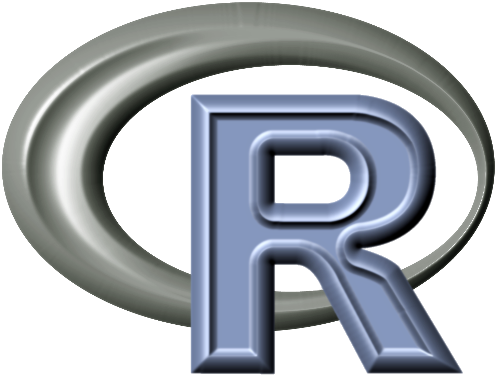
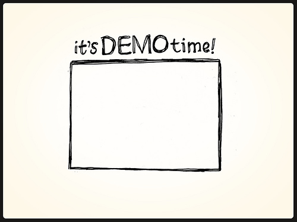

[//]: # (Change the background color of the title slide)

<style>
  .title-slide {
    background-color:  #EDE0CF; /*; ; #CA9F9D*/
      /* background-image:url(http://goo.gl/EpXln); */
  }
</style>


<div style='text-align: center;'>
    
</div>

--- &twocol

## Welcome

> - Goal of today is to show you what R can do

> - 2-hours are not enough though...

> - But I will show what is relevant for your research

*** =right 


<div style='text-align: center;'>
    
</div>


---

## The thing called R

> - R is a programming language widely used for statistics

> - Born: 1993

> - After 22 years, R is more popular than every before!

> - But why?


---

## Reasons why R is cool

> - R allows a wide array of statistical analyses

> - If used in combination with other languages (markdown) you
can get reports of data

> - It is actually free and plenty of online resources are free

> - Open source

> - Large supporting community

<div style='text-align: center;'>
    
</div>

---

## So what can R do for me?

<div style='text-align: center;'>
    
</div>

---
# Simple stuff that you can do in R


```r
"Hello, World!"
```

[1] "Hello, World!"


```r
2 + 2
```

[1] 4


```r
1000/10
```

[1] 100


```r
1:10 - .5
```

 [1] 0.5 1.5 2.5 3.5 4.5 5.5 6.5 7.5 8.5 9.5

--- 
## R's plots


```r
plot(1:10)
```

 

--- 

## Interactive Console

<!-- MotionChart generated in R 3.2.2 by googleVis 0.5.10 package -->
<!-- Tue Nov 10 09:39:26 2015 -->


<!-- jsHeader -->
<script type="text/javascript">
 
// jsData 
function gvisDataMotionChartID4a43b792bdd () {
var data = new google.visualization.DataTable();
var datajson =
[
 [
 "Apples",
2008,
"West",
98,
78,
20,
"2008-12-31" 
],
[
 "Apples",
2009,
"West",
111,
79,
32,
"2009-12-31" 
],
[
 "Apples",
2010,
"West",
89,
76,
13,
"2010-12-31" 
],
[
 "Oranges",
2008,
"East",
96,
81,
15,
"2008-12-31" 
],
[
 "Bananas",
2008,
"East",
85,
76,
9,
"2008-12-31" 
],
[
 "Oranges",
2009,
"East",
93,
80,
13,
"2009-12-31" 
],
[
 "Bananas",
2009,
"East",
94,
78,
16,
"2009-12-31" 
],
[
 "Oranges",
2010,
"East",
98,
91,
7,
"2010-12-31" 
],
[
 "Bananas",
2010,
"East",
81,
71,
10,
"2010-12-31" 
] 
];
data.addColumn('string','Fruit');
data.addColumn('number','Year');
data.addColumn('string','Location');
data.addColumn('number','Sales');
data.addColumn('number','Expenses');
data.addColumn('number','Profit');
data.addColumn('string','Date');
data.addRows(datajson);
return(data);
}
 
// jsDrawChart
function drawChartMotionChartID4a43b792bdd() {
var data = gvisDataMotionChartID4a43b792bdd();
var options = {};
options["width"] =    600;
options["height"] =    500;
options["state"] = "";

    var chart = new google.visualization.MotionChart(
    document.getElementById('MotionChartID4a43b792bdd')
    );
    chart.draw(data,options);
    

}
  
 
// jsDisplayChart
(function() {
var pkgs = window.__gvisPackages = window.__gvisPackages || [];
var callbacks = window.__gvisCallbacks = window.__gvisCallbacks || [];
var chartid = "motionchart";
  
// Manually see if chartid is in pkgs (not all browsers support Array.indexOf)
var i, newPackage = true;
for (i = 0; newPackage && i < pkgs.length; i++) {
if (pkgs[i] === chartid)
newPackage = false;
}
if (newPackage)
  pkgs.push(chartid);
  
// Add the drawChart function to the global list of callbacks
callbacks.push(drawChartMotionChartID4a43b792bdd);
})();
function displayChartMotionChartID4a43b792bdd() {
  var pkgs = window.__gvisPackages = window.__gvisPackages || [];
  var callbacks = window.__gvisCallbacks = window.__gvisCallbacks || [];
  window.clearTimeout(window.__gvisLoad);
  // The timeout is set to 100 because otherwise the container div we are
  // targeting might not be part of the document yet
  window.__gvisLoad = setTimeout(function() {
  var pkgCount = pkgs.length;
  google.load("visualization", "1", { packages:pkgs, callback: function() {
  if (pkgCount != pkgs.length) {
  // Race condition where another setTimeout call snuck in after us; if
  // that call added a package, we must not shift its callback
  return;
}
while (callbacks.length > 0)
callbacks.shift()();
} });
}, 100);
}
 
// jsFooter
</script>
 
<!-- jsChart -->  
<script type="text/javascript" src="https://www.google.com/jsapi?callback=displayChartMotionChartID4a43b792bdd"></script>
 
<!-- divChart -->
  
<div id="MotionChartID4a43b792bdd" 
  style="width: 600; height: 500;">
</div>


