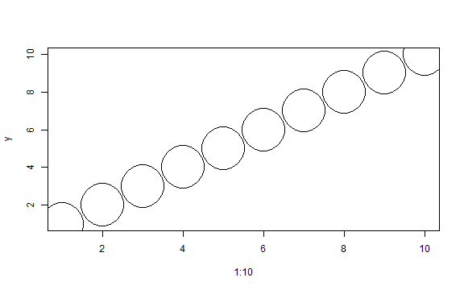
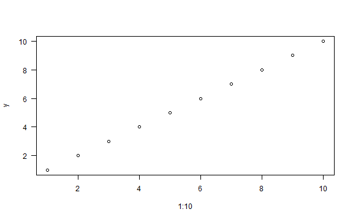
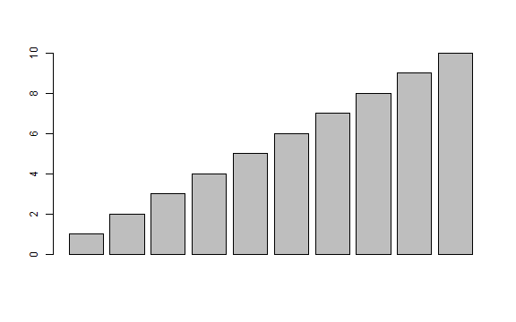

<style>
  .title-slide {
    background-color:  #8B4513; /*; ; #CA9F9D*/
      /* background-image:url(http://goo.gl/EpXln); */
  }
</style>


<style>
.title-slide hgroup > h1, 
.title-slide hgroup > h2 {
  color: #F5F5F5 ;  /* ; #EF5150*/
}
</style>


--- 
## Goals of today's presentation

- Assignment 2 (Feedback)

- Implicit looping (good and bad)

- Introduction to plots

---
## Assignment 2

- Goals
  - Get you know how to work with (explicit) looping
  - Show you how to write and import data
  - Show you a general workflow for loading data

> - What did you think of the assignment?
  > - General difficulties?
  > - Did the hints help?
  > - Anything else we can add?


---
## Explicit vs. Implicit looping

- In general, loops should be avoided
- However, implicit looping better explicit looping

--- 
### Loop statements

- 'A sequence of instruction s that is continually repeated until a certain condition is reached' [reference](http://whatis.techtarget.com/definition/loop)
- Avoid whenever possible (but that is not always possible)
- Whenever use, chose *implicit* over *explicit* looping

--- &twocol
### Explicit vs. Implicit looping

***=left
**Explicit loops**

- + Easy to learn and understand
- + Easy to read
- +/- easy to creat
- - Slow
- - Ugly

***=right
**Implicit loops**

- + Faster programs
- + Shorter programs
- + Points on geekiness
- - Harder to learn
- - Harder to remember
- - Harder to understand

[Once again, Wisdom from Yihui](http://yihui.name/en/2010/10/on-the-gory-loops-in-r/)

---
## **apply** 

apply(x, margin, function, ...)

**x** = two dimension array 

**margin** = a vector giving the subscripts which the function will be applied over. E.g., for a matrix 1 indicates rows, 2 indicates columns, c(1, 2) indicates rows and columns. Where X has named dimnames, it can be a character vector selecting dimension names.

**Function** = The function to be applied

---
## **apply** Example


```r
x = matrix(1:10, 5, 2)
apply(x, 1, mean)
```

```
## [1] 3.5 4.5 5.5 6.5 7.5
```

```r
apply(x, 2, mean)
```

```
## [1] 3 8
```


```r
y = array(1:24, dim = c(2, 3, 4))
apply(y, 3, mean)
```

```
## [1]  3.5  9.5 15.5 21.5
```

---
## **tapply** 

tapply(x, index, function, ...)

x = typically a numeric vector
index = factor. If more than one factor, make a list
function = function


```r
x = data.frame(ID = 1:10, RT = rnorm(10), Group = rep(1:2, 5), Pic = rep(c("Neg", "Pos"), each = 5))
tapply(x$RT, list(x$Group, x$Pic), mean)
```

```
##          Neg       Pos
## 1  0.1801771 0.4367327
## 2 -0.4743500 0.3864836
```

---
## *lapply*

lapply(x, function)

x = list
function = function


```r
x <- list(ID = 1:10, RT = rnorm(10), Group = rep(1:2, 5))
lapply(x, mean)
```

```
## $ID
## [1] 5.5
## 
## $RT
## [1] 0.6226434
## 
## $Group
## [1] 1.5
```

---
## *sapply*

sapply(x, function)

x = list
function = function


```r
x <- list(ID = 1:10, RT = rnorm(10), Group = rep(1:2, 5))
sapply(x, mean)
```

```
##          ID          RT       Group 
##  5.50000000 -0.07251578  1.50000000
```

---
## *ddply*

ddply(.data, .variables, function)

data = data.frame
variables = variables to split data frame
function = function to be applied


```r
library(plyr)
```

```
## 
## Attaching package: 'plyr'
```

```
## The following object is masked from 'package:twitteR':
## 
##     id
```

```r
dfx <- data.frame(
group = c(rep('A', 8), rep('B', 15), 
          rep('C', 6)),
sex = sample(c("M", "F"), size = 29, replace = TRUE),
age = runif(n = 29, min = 18, max = 54))
ddply(dfx, .(group, sex), summarize,
mean = round(mean(age), 2),
sd = round(sd(age), 2))
```

```
##   group sex  mean    sd
## 1     A   F 40.19  9.78
## 2     A   M 34.71 16.84
## 3     B   F 39.81 10.27
## 4     B   M 36.84 10.44
## 5     C   F 36.73  7.09
## 6     C   M 35.67 13.18
```

---
## Plots

- R is quite powerful in terms of plots
- Plenty of packages for producting plots

- *Packages*
- base : The basic plots (high level and low level functions)
- lattice : Enhancement of the base graphics
- ggplot2 : Modern way to do plots

---


```r
y <- 21:30
y
```

```
##  [1] 21 22 23 24 25 26 27 28 29 30
```

```r
plot(x = 1:10, y = y)
```


---


```r
y <- 1:10
layout(t(1:3))
plot(y)
plot(y, type = "l", col = "red")
plot(y, type = "b", col = "blue")
```


---
### par

> Par is your friend!

> ?par and you can see important arguments for changing your graphs.

> Let's see some examples

---

```r
plot(x = 1:10, y = y, col = 1:10)
```


---

```r
plot(x = 1:10, y = y, xaxt = "n", yaxt = "n")
```


---

```r
plot(x = 1:10, y = y, bty = "n")
```


---

```r
plot(x = 1:10, y = y, cex = 10)
```



---

```r
plot(x = 1:10, y = y, las = 1)
```



---&twocol

***=left

```r
barplot(1:10)
```



***=right

```r
barplot(matrix(1:10, 5, 2), beside = T)
```


---

```r
plot(x = 1:10, y = y, pch = 1:10)
```


---
## Low level functions

> You can change your plot using low level functions 
> Those should be used *after* you make the plot

---

```r
plot(x = 1:10, y = y)
mtext("I like trains", 3)
```


---

```r
plot(x = 1:10, y = y)
text(2, 8, "I still like trains")
```


---

```r
plot(x = 1:10, y = y)
legend(2, 8, legend = "dot -- what a surprise!", pch = 1)
```


---

```r
plot(x = 1:10, axes = FALSE)
axis(3)
axis(4, at = seq(0, 10, 5), legend = seq(0, 10, 5))
```

```
## Warning in axis(4, at = seq(0, 10, 5), legend = seq(0, 10, 5)): "legend" is
## not a graphical parameter
```


---

```r
plot(x = 1:10, y = y)
points(c(5, 6))
lines(c(8, 10), c(7, 9))
```


---
## Saving plots

You need to create -- and close -- a new device

> pdf
> jpg
> png
> postscript

You close the device with dev.off()

---
## ggplot

> ggplot is the modern way to create plots
> Although we are not extending here, please check [link](https://www.rstudio.com/wp-content/uploads/2015/03/ggplot2-cheatsheet.pdf)


---
## Instructions on Assignment

- All assignments can be found [here](https://github.com/AngelosPsy/EPPR/tree/master/Assignments)
- You can hand in your assignments by sending me an html document, with, when
asked, runnable code.
- Go as far as possible with the assignment. If you cannot complete it, no problem.
- I AM AVAILABLE FOR QUESTIONS!!!!!!
- Note: make sure that you remove the "eval = T", wherever you see it.
- Note: For writing text you should start each line with "#'" (without the quotation marks)

---

## The end
