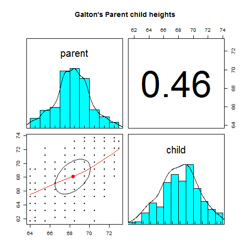
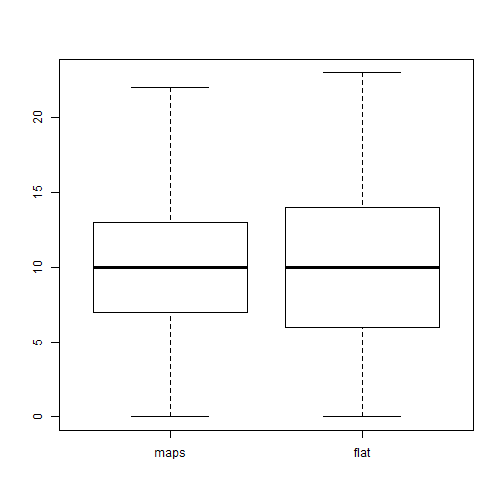

pre {
  font-size: 5px;
}

slide.smallcode pre {
  font-size: 5px;
}

<style>
  .title-slide {
    background-color:  #808080; /*; ; #CA9F9D*/
      /* background-image:url(http://goo.gl/EpXln); */
  }
</style>


<style>
.title-slide hgroup > h1, 
.title-slide hgroup > h2 {
  color: #F5F5F5 ;  /* ; #EF5150*/
}
</style>


--- 
## Goals of today's presentation

- Assignment 3 (Feedback)

- Analyses with R

- Decide next lecture

---
## Assignment 2

- Any comments?

---
## Basic descriptives


```r
library(psych, quietly = TRUE) # Load psych library
data(galton) # Load galton data
head(galton, n = 2) # Head of data
```

```
##   parent child
## 1   70.5  61.7
## 2   68.5  61.7
```

```r
describe(galton) # Basic descriptives
```

```
##        vars   n  mean   sd median trimmed  mad  min  max range  skew
## parent    1 928 68.31 1.79   68.5   68.32 1.48 64.0 73.0     9 -0.04
## child     2 928 68.09 2.52   68.2   68.12 2.97 61.7 73.7    12 -0.09
##        kurtosis   se
## parent     0.05 0.06
## child     -0.35 0.08
```

---
## Correlations


```r
pairs.panels(galton, main="Galton's Parent child heights")  
```



---
## Correlations


```r
cor(galton$parent, galton$child)
```

```
## [1] 0.4587624
```

```r
cor.test(galton$parent, galton$child)
```

```
## 
## 	Pearson's product-moment correlation
## 
## data:  galton$parent and galton$child
## t = 15.711, df = 926, p-value < 2.2e-16
## alternative hypothesis: true correlation is not equal to 0
## 95 percent confidence interval:
##  0.4064067 0.5081153
## sample estimates:
##       cor 
## 0.4587624
```

---
## Linear regression (1)

lm(DV~IV1)


```r
data(affect)
res <- lm(state1~state2, data = affect)
summary(res)
```

```
## 
## Call:
## lm(formula = state1 ~ state2, data = affect)
## 
## Residuals:
##     Min      1Q  Median      3Q     Max 
## -29.003  -5.248  -0.419   4.588  40.947 
## 
## Coefficients:
##             Estimate Std. Error t value Pr(>|t|)    
## (Intercept)  20.9848     2.6402   7.948 2.62e-13 ***
## state2        0.4851     0.0603   8.045 1.48e-13 ***
## ---
## Signif. codes:  0 '***' 0.001 '**' 0.01 '*' 0.05 '.' 0.1 ' ' 1
## 
## Residual standard error: 8.433 on 168 degrees of freedom
##   (160 observations deleted due to missingness)
## Multiple R-squared:  0.2781,	Adjusted R-squared:  0.2738 
## F-statistic: 64.73 on 1 and 168 DF,  p-value: 1.482e-13
```

```r
## Also run plot(res)
```

---

lm(DV~IV1+IV2): Only main effects


```r
res <- lm(state1~state2+NA2, data = affect)
summary(res)
```

```
## 
## Call:
## lm(formula = state1 ~ state2 + NA2, data = affect)
## 
## Residuals:
##     Min      1Q  Median      3Q     Max 
## -28.094  -5.025  -0.579   3.749  43.040 
## 
## Coefficients:
##             Estimate Std. Error t value Pr(>|t|)    
## (Intercept) 18.18405    3.12207   5.824 2.87e-08 ***
## state2       0.58255    0.08394   6.940 8.25e-11 ***
## NA2         -0.30255    0.18233  -1.659   0.0989 .  
## ---
## Signif. codes:  0 '***' 0.001 '**' 0.01 '*' 0.05 '.' 0.1 ' ' 1
## 
## Residual standard error: 8.389 on 167 degrees of freedom
##   (160 observations deleted due to missingness)
## Multiple R-squared:  0.2898,	Adjusted R-squared:  0.2813 
## F-statistic: 34.08 on 2 and 167 DF,  p-value: 3.876e-13
```


---

lm(DV~IV1:IV2): Only interaction(s)


```r
res <- lm(state1~state2:NA2, data = affect)
summary(res)
```

```
## 
## Call:
## lm(formula = state1 ~ state2:NA2, data = affect)
## 
## Residuals:
##     Min      1Q  Median      3Q     Max 
## -25.639  -6.445  -0.933   5.784  34.647 
## 
## Coefficients:
##              Estimate Std. Error t value Pr(>|t|)    
## (Intercept) 39.216167   0.915362  42.842  < 2e-16 ***
## state2:NA2   0.010528   0.002496   4.217 4.03e-05 ***
## ---
## Signif. codes:  0 '***' 0.001 '**' 0.01 '*' 0.05 '.' 0.1 ' ' 1
## 
## Residual standard error: 9.438 on 168 degrees of freedom
##   (160 observations deleted due to missingness)
## Multiple R-squared:  0.09573,	Adjusted R-squared:  0.09035 
## F-statistic: 17.79 on 1 and 168 DF,  p-value: 4.034e-05
```


---
lm(DV~IV1*IV2): All single effects and interaction(s)


```r
res <- lm(state1~state2*NA2, data = affect)
summary(res)
```

```
## 
## Call:
## lm(formula = state1 ~ state2 * NA2, data = affect)
## 
## Residuals:
##     Min      1Q  Median      3Q     Max 
## -26.013  -5.195  -0.692   3.553  41.302 
## 
## Coefficients:
##             Estimate Std. Error t value Pr(>|t|)    
## (Intercept) 15.80457    3.58092   4.414 1.82e-05 ***
## state2       0.63637    0.09278   6.859 1.31e-10 ***
## NA2          0.51893    0.63662   0.815    0.416    
## state2:NA2  -0.01573    0.01168  -1.346    0.180    
## ---
## Signif. codes:  0 '***' 0.001 '**' 0.01 '*' 0.05 '.' 0.1 ' ' 1
## 
## Residual standard error: 8.369 on 166 degrees of freedom
##   (160 observations deleted due to missingness)
## Multiple R-squared:  0.2975,	Adjusted R-squared:  0.2848 
## F-statistic: 23.43 on 3 and 166 DF,  p-value: 1.066e-12
```

---
# t.tests
First, boxplots

```r
boxplot(neur~Study, data = affect)
```



---
# t.tests (Indepedent samples)


```r
t.test(neur~Study, data = affect)
```

```
## 
## 	Welch Two Sample t-test
## 
## data:  neur by Study
## t = -0.14477, df = 327.39, p-value = 0.885
## alternative hypothesis: true difference in means is not equal to 0
## 95 percent confidence interval:
##  -1.171356  1.010768
## sample estimates:
## mean in group maps mean in group flat 
##           10.17500           10.25529
```

---
# t.tests (Dependent samples)


```r
t.test(affect$PA1, affect$NA1, paired = TRUE)
```

```
## 
## 	Paired t-test
## 
## data:  affect$PA1 and affect$NA1
## t = 11.723, df = 329, p-value < 2.2e-16
## alternative hypothesis: true difference in means is not equal to 0
## 95 percent confidence interval:
##  4.322896 6.066194
## sample estimates:
## mean of the differences 
##                5.194545
```

---
# ANOVA

Multiple ways to do so

The _ez_ package is a good way to do ANOVAS easily

---
# ANOVA


```r
library(ez, quietly = TRUE)
data("ANT")
head(ANT, n = 3)
```

```
##   subnum     group block trial    cue   flank location direction       rt
## 1      1 Treatment     1     1   None Neutral       up      left 398.6773
## 2      1 Treatment     1     2 Center Neutral       up      left 389.1822
## 3      1 Treatment     1     3 Double Neutral       up      left 333.2186
##   error
## 1     0
## 2     0
## 3     0
```

---
# ANOVA


```r
res <- ezANOVA(              ### The function
data = ANT[ANT$error==0,],    ### The data to be used
dv = rt,                   ### The dependent variable
wid = subnum,              ### The subject factor
within = .(cue,flank),     ### Within subject variable
between = group,           ### group variablew
type = 3                    ### Ensure that results are comparable to SPSS results
)
```

```
## Warning: Collapsing data to cell means. *IF* the requested effects are a
## subset of the full design, you must use the "within_full" argument, else
## results may be inaccurate.
```


---
# ANOVA


```r
res$ANOVA
```

```
##            Effect DFn DFd           F            p p<.05        ges
## 2           group   1  18   18.430592 4.377562e-04     * 0.07633358
## 3             cue   3  54  516.605213 1.005518e-39     * 0.89662286
## 5           flank   2  36 1350.598810 1.386546e-34     * 0.92710583
## 4       group:cue   3  54    2.553236 6.497492e-02       0.04110445
## 6     group:flank   2  36    8.768499 7.900829e-04     * 0.07627434
## 7       cue:flank   6 108    5.193357 9.938494e-05     * 0.11436699
## 8 group:cue:flank   6 108    6.377225 9.012515e-06     * 0.13686958
```


---
# ANOVA


```r
res$`Mauchly's Test for Sphericity`
```

```
##            Effect         W         p p<.05
## 3             cue 0.7828347 0.5366835      
## 4       group:cue 0.7828347 0.5366835      
## 5           flank 0.8812738 0.3415406      
## 6     group:flank 0.8812738 0.3415406      
## 7       cue:flank 0.1737053 0.1254796      
## 8 group:cue:flank 0.1737053 0.1254796
```

---
# ANOVA


```r
res$`Sphericity Corrections`
```

```
##            Effect       GGe        p[GG] p[GG]<.05       HFe        p[HF]
## 3             cue 0.8652559 1.115029e-34         * 1.0239520 1.005518e-39
## 4       group:cue 0.8652559 7.472046e-02           1.0239520 6.497492e-02
## 5           flank 0.8938738 3.763312e-31         * 0.9858964 3.964046e-34
## 6     group:flank 0.8938738 1.297752e-03         * 0.9858964 8.438369e-04
## 7       cue:flank 0.6022111 1.546166e-03         * 0.7721473 4.745714e-04
## 8 group:cue:flank 0.6022111 3.424499e-04         * 0.7721473 7.170939e-05
##   p[HF]<.05
## 3         *
## 4          
## 5         *
## 6         *
## 7         *
## 8         *
```


---
# BAYES WILL TEAR US APART

- rbugs (R and WinBugs)


- rjags (R and JAGS)

- Rstan (R and STAN)

---
# BayesFactor

The BayesFactor package allows the easy computation of Bayes
factors for common statistical designs

BayesFactor is not suitable for parameter estimation

This [webpage](http://bayesfactorpcl.r-forge.r-project.org/) is absolutely amazing for further info 

---
## Bayesian t-test


```r
data(affect)
library(BayesFactor)
res = ttestBF(affect$neur[affect$Study == "maps"], affect$neur[affect$Study == "maps"], rscale = .707)
```

---
## Bayesian t-test


```r
res
```

```
## Bayes factor analysis
## --------------
## [1] Alt., r=0.707 : 0.1232139 ±0%
## 
## Against denominator:
##   Null, mu1-mu2 = 0 
## ---
## Bayes factor type: BFindepSample, JZS
```

```r
1/res
```

```
## Bayes factor analysis
## --------------
## [1] Null, mu1-mu2=0 : 8.115965 ±0%
## 
## Against denominator:
##   Alternative, r = 0.707106781186548, mu =/= 0 
## ---
## Bayes factor type: BFindepSample, JZS
```

---
## Bayesian regression


```r
lmBF(ext~Study, data = affect)
```

```
## Bayes factor analysis
## --------------
## [1] Study : 0.1942419 ±0%
## 
## Against denominator:
##   Intercept only 
## ---
## Bayes factor type: BFlinearModel, JZS
```

---
## Bayesian ANOVA


```r
res <- anovaBF(rt ~ cue *  group + subnum, whichRandom = "subnum",
  data = ANT, progress = FALSE)
```


---
## Bayesian ANOVA


```r
res
```

```
## Bayes factor analysis
## --------------
## [1] group + subnum                   : 0.1523768     ±1.15%
## [2] cue + subnum                     : 3.381332e+263 ±0.62%
## [3] group + cue + subnum             : 5.541766e+262 ±1.68%
## [4] group + cue + group:cue + subnum : 1.912368e+261 ±2.05%
## 
## Against denominator:
##   rt ~ subnum 
## ---
## Bayes factor type: BFlinearModel, JZS
```

---
## Instructions on Assignment

- All assignments can be found [here](https://github.com/AngelosPsy/EPPR/tree/master/Assignments)
- You can hand in your assignments by sending me an html document, with, when
asked, runnable code.
- Go as far as possible with the assignment. If you cannot complete it, no problem.
- I AM AVAILABLE FOR QUESTIONS!!!!!!
- Note: make sure that you remove the "eval = T", wherever you see it.
- Note: For writing text you should start each line with "#'" (without the quotation marks)

---

## The end
